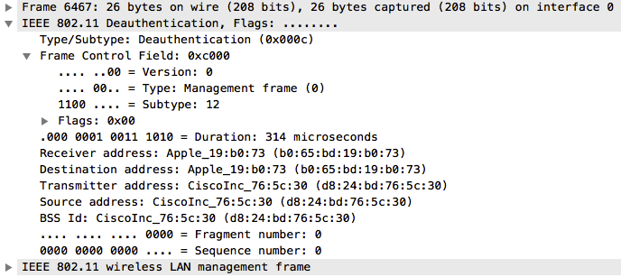

#描述

用来断开工作站(Station)与接入点(AP)的连接

#运行环境

macOS

#编译&运行
	$make
	$./deauth <interface> -s <Station> -a <Access points>
	$./deauth en1 -s b0:65:bd:19:b0:73 -a d8:24:bd:76:5c:30 --rate 10 --number 5000
	
#抓包
	

	
